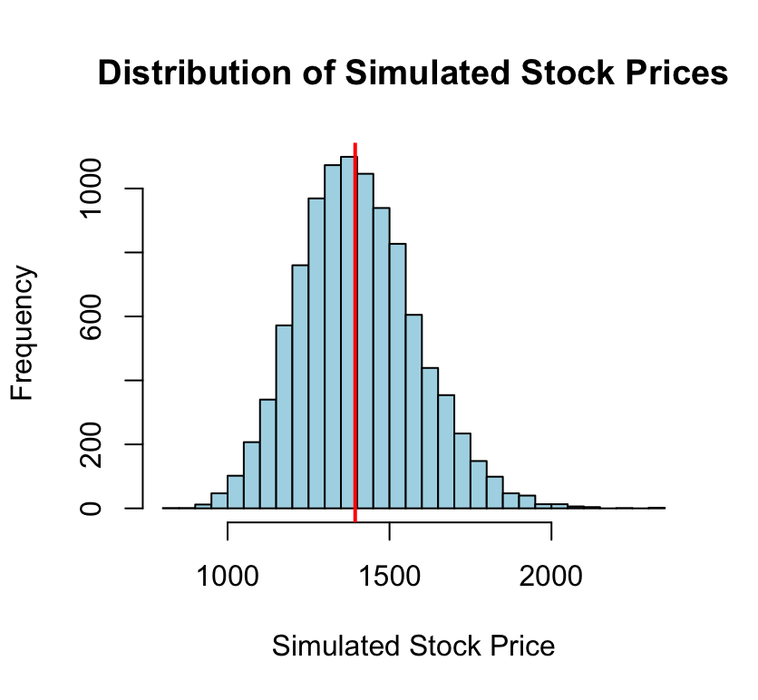
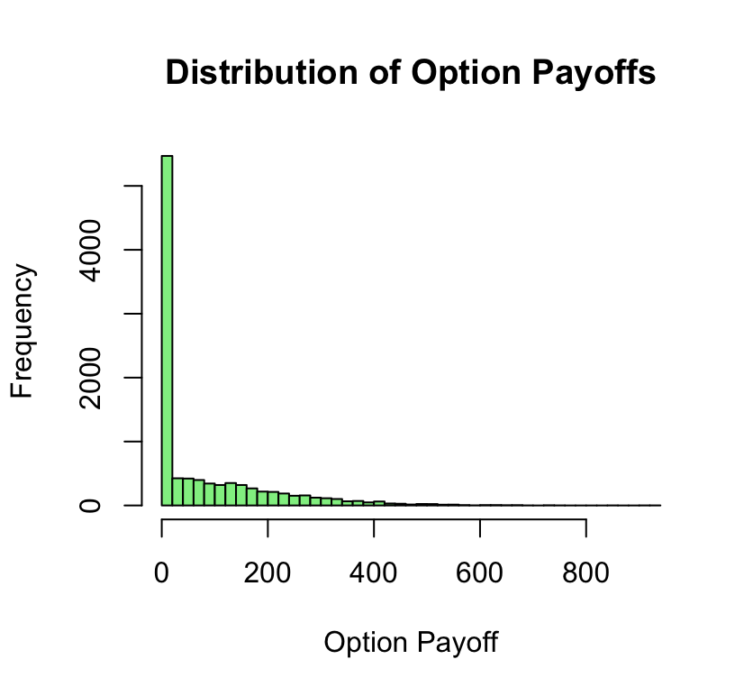

# Black-Scholes Option Pricing for Reliance Industries

This project implements the Black–Scholes option pricing model to estimate the value of a European call option on Reliance Industries. The analytical price obtained from the Black–Scholes formula is validated using Monte Carlo simulation.

## Project Objective

The goal of this project is to estimate the theoretical value of a European call option using:

- Black–Scholes analytical pricing model
- Monte Carlo simulation
- Historical volatility estimation
- Option Greeks analysis

## Key Concepts

This project demonstrates several important concepts in quantitative finance:

- Black–Scholes option pricing model
- Historical volatility estimation
- Log return calculation
- Monte Carlo simulation for asset price modeling
- Geometric Brownian Motion (GBM)
- Option Greeks (Delta, Gamma, Vega, Theta)
- Risk-neutral valuation

## Dataset

Historical daily stock price data for **Reliance Industries Ltd.** was obtained from the National Stock Exchange (NSE).

Dataset period:  
2023 – 2026

The dataset is used to compute daily log returns and estimate historical volatility.

## Methodology

The following steps were performed:

1. Import and combine historical stock price data
2. Calculate daily log returns
3. Estimate annualized volatility
4. Apply the Black–Scholes formula
5. Simulate stock prices using Monte Carlo simulation
6. Estimate option price from simulated payoffs
7. Calculate option Greeks (Delta, Gamma, Vega, Theta)

## Model Inputs

| Parameter | Description | Value |
|----------|-------------|------|
| S0 | Current stock price | 1393.9 |
| K | Strike price | 1393.9 |
| r | Risk-free interest rate | 0.067 |
| σ | Annualized volatility | 0.4519527 |
| T | Time to maturity | 30/365 |

## Results

Black–Scholes Call Option Price (Analytical): **₹75.70**

Monte Carlo Simulation Price: **₹75.84**

The close agreement between these results validates the analytical pricing model.

## Simulation Visualizations

### Distribution of Simulated Stock Prices

### Distribution of Option Payoffs

## Project Structure

Black-Scholes-Option_Pricing  
│  
├── code  
│   └── Black Scholes Reliance Project.R  
│  
├── data  
│   ├── 01:03:23-01:03:24.csv  
│   ├── 01:03:24-01:03:25.csv  
│   └── 01:03:25-01:03:26.csv  
│  
├── outputs  
│   └── (graphs and simulation outputs)  
│  
└── report  
    └── Black Scholes Project Report.pdf

## Author

Ananya Pahwa

## License

This project is shared for learning and portfolio purposes.
